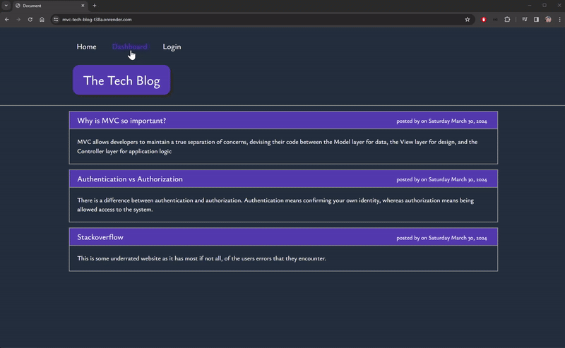

# MVC Tech Blog!

        
# Description

[](https://opensource.org/licenses/MIT)<br><br>

This website is a tech blog where people can create an account and post blogs about tech or just anything in general! Users are able to edit or delete content and comment on other people's posts as well.
# Deployment

[Click here for deployed page!](https://mvc-tech-blog-t38a.onrender.com/)

# Table of Contents

* [Installation](#installation)
* [Usage](#usage)
* [License](#license)
* [Contributing](#contributing)
* [Questions](#questions)

# Installation

* There is no separate installation to be done to run this website. If you want to run this on your local machine after cloning it, then run the following commands.

    ```
    npm i
    ```

* Also, please ensure that your `.env.EXAMPLE` file is renamed to `.env` and content filled out with your postgresSQL user / password. Secret key can be choice of your own.
    ```
    DB_NAME='tech_db'
    DB_USER=''
    DB_PASSWORD=''
    DB_SECRET_KEY=''
    ```

* Next step is to run your postgres in the terminal and run the schema.sql file.

    ```
    psql -U postgres
    ```

    - enter your credential to login to postgres and then run the following commands in order

        ```postgres
        \i db/schema.sql
        ```
    - to exit postgres :
        ```
        \q
        ```

* Once installation is done for npm pacakages, you may run the terminal program by running the following command at root of the project:

    ```
    node server.js
    ```

* Afterwards, if you want to test the get/put/post/delete api requests, [Insomnia (link to download)](https://insomnia.rest/download) is recommended for testing! Please note that no sign up is necessary to use insomina. You can just use the scratch pad!


# Usage

This web app will help people interact with each other through blog posts / comments because sharing ideas and thoughts is cool!


- Below is sample demo.<br><br>


# License

Licensed by MIT License

# Contributing

Any contributions, issues, or feature requests are welcome!


# Questions

Please reach me via github or email if you have any questions, concerns, or remarks 😉<br><br>
    - [My Github Link](https://github.com/ericeya) <br>
    - eric.hyunil.lee@gmail.com
      